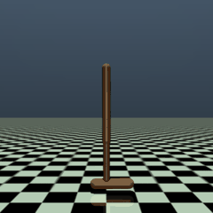

# Physics-Based Animation & Humanoid Locomotion

Building a physics-based humanoid that learns to imitate motion-capture clips with deep reinforcement learning — a from-scratch implementation in the spirit of [DeepMimic](https://xbpeng.github.io/projects/DeepMimic/) (Peng et al. 2018).

<p align="center">
  <br>
  <i>A MuJoCo Hopper controlled by our from-scratch PPO (≈3300 return) — the Phase&nbsp;1 milestone.</i>
</p>

**Status:** Phase 1 (RL foundations) — ✅ complete: Q-learning → REINFORCE → actor-critic → PPO+GAE, solving CartPole and the Hopper above. Phase 2 (simulation & control) next.

## Roadmap

1. **RL foundations** — implement Q-learning, REINFORCE, actor-critic, and PPO+GAE *from scratch*; milestone: a MuJoCo Hopper walking under our own PPO.
2. **Simulation & control fundamentals** — MuJoCo, rigid-body dynamics, contact, PD control.
3. **DeepMimic** — humanoid imitates mocap clips via deep RL (the flagship).
4. **One extension** — sim-to-real / differentiable sim / GPU-parallel / AMP.

## Repo layout

```
rlfoundations/        Phase 1 package (RL algorithms — implemented from scratch)
  algorithms/         q_learning, reinforce, actor_critic, ppo
  envs.py             Gymnasium environment factory
  config.py           run configuration
  utils/              seeding, Weights & Biases logging
scripts/              runnable entry points (smoke_test, training)
notes/   (local-only, gitignored)  computer-animation course notes
papers/  (local-only, gitignored)  reference papers
```

## Setup

```powershell
py -m venv .venv
.\.venv\Scripts\Activate.ps1
python -m pip install --upgrade pip
pip install -e .
```

Smoke test (random policy on CartPole, logs to W&B in offline mode):

```powershell
python scripts/smoke_test.py
```

For the hosted experiment dashboard: run `wandb login` once, then set `RunConfig.wandb_mode = "online"`.
